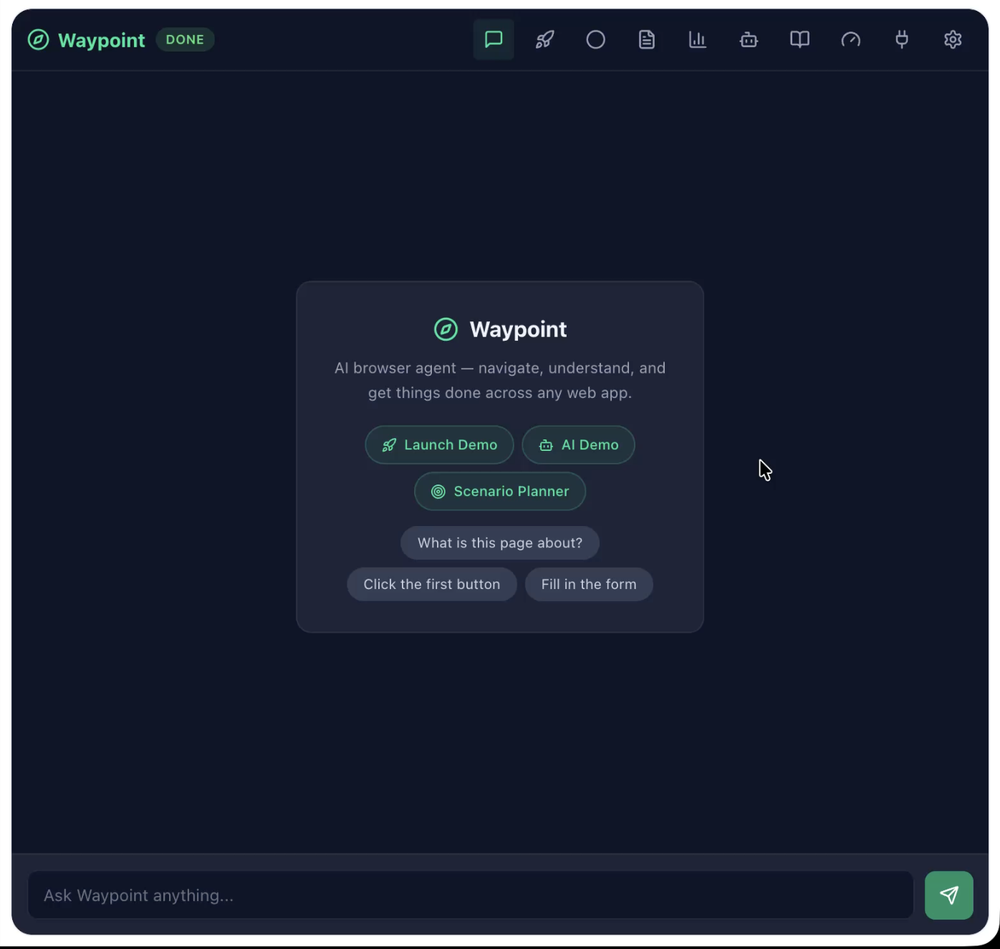

# Waypoint

**Waypoint** is an AI-powered browser agent built as a Chrome extension. It sits in your browser's side panel and lets you automate multi-tab workflows using plain English — no scripting, no RPA tools, no manual clicking across systems.

Describe what you want done. Waypoint figures out which systems to open, reads their live page structure, builds an executable step-by-step plan, asks for anything it needs from you, and carries it out — across as many browser tabs as required.



---

## How It Works

Waypoint runs a multi-agent pipeline powered by the Anthropic Claude API:

1. **Orchestrator** — reads your request and decides which agents to involve
2. **Site Selector** — consults your Knowledge Base to identify the right system URLs
3. **DOM Reader** — opens each system in a tab and extracts its live page structure
4. **DOM Interpreter** — maps form fields and buttons to exact CSS selectors
5. **Plan Generator** — produces a structured action plan using only real selectors from the live page
6. **Executor** — runs the plan step by step, pausing to ask you for input when needed

---

## Features

### AI Chat
Talk to Waypoint like a colleague. Ask questions about the current page, request navigation, or describe a multi-step task. Responses are rendered with full markdown support — tables, code blocks, bullet lists.

### Scenario Planner
Describe a complex workflow in one sentence. Waypoint runs the full multi-agent pipeline to produce a complete, executable action plan across multiple systems — then shows it to you for review before doing anything.

### Action Plan Approval
Every generated plan is shown as a visual card with per-step icons, descriptions, and value hints before execution. You choose to Approve & Run, Save for later, or Cancel.

### Multi-Tab Execution
Plans execute across browser tabs automatically — switching tabs, reading data, filling forms, clicking buttons, and waiting for pages to load — all without you touching the keyboard.

### Interaction Steps
Plans can include `ask_user` steps that pause execution mid-flow and prompt you for specific input (name, reference number, choice), then continue with your answer injected into the relevant form fields.

### Action Recording
Record your own workflows by clicking through a task manually. Waypoint captures every click and input, then lets you replay or save the recording as a reusable workflow.

### Workflow Library
Save AI-generated plans or recordings as named workflows. Replay any workflow with one click from the Workflows panel.

### Knowledge Base
Upload system documentation, URLs, or reference material as text documents. The KB is searched automatically when Waypoint needs to identify which systems are relevant to your request.

### Custom Agents
Define your own Claude agents with custom system prompts, token limits, and model selection. Custom agents plug into the pipeline between the DOM Reader and Plan Generator stages, letting you add domain-specific reasoning steps.

### Per-Agent Model Selection
Each agent in the pipeline can run on a different Claude model. Fetch the live list of available models directly from the Anthropic API and assign them per agent or globally via Settings.

### MCP Store
Connect Model Context Protocol (MCP) servers to give Waypoint access to external tools — databases, APIs, internal services — which Claude can call as part of any conversation or plan.

### Web Performance Monitor
Open any tab and instantly see its Core Web Vitals (LCP, FCP, CLS, TTFB, TBT), resource waterfall, JavaScript memory usage, and network connection quality. Request an AI analysis to get Claude's recommendations for improving page performance. Export any report as JSON.

### PII Masking
Optionally mask personally identifiable information (emails, phone numbers, credit cards, passport numbers) before it reaches the Claude API, keeping sensitive data within your browser.

### Dynamic Site Theming
The extension UI adopts the accent colour of whichever site is in your active tab — extracted from CSS variables and the page favicon — so it always feels contextually matched to what you're working in.

---

## Getting Started

### Prerequisites
- Google Chrome (Manifest V3 support required)
- An [Anthropic API key](https://console.anthropic.com/)
- Node.js 18+

### Build & Install

```bash
# Install dependencies
npm install

# Build the extension
npm run build

# Optional: start demo servers (ports 3000 and 3001)
npm run demo
```

1. Open `chrome://extensions` in Chrome
2. Enable **Developer mode** (top right toggle)
3. Click **Load unpacked** and select the `dist/` folder
4. Open any webpage and click the Waypoint icon in the toolbar to open the side panel

### Configuration

Click the **Settings** (⚙) icon in the panel header:

- **Claude API Key** — paste your `sk-ant-...` key; model list loads automatically
- **Claude Model** — select from the live list of available models
- **PII Masking** — toggle on to redact sensitive data before API calls

---

## Development

```bash
npm run dev          # Watch build + demo servers
npm run typecheck    # TypeScript strict check
npm test             # Run test suite (Vitest)
npm run test:watch   # Watch mode
npm run test:coverage  # Coverage report
```

Reference docs are in the `docs/` folder:

| File | Contents |
|------|----------|
| `docs/architecture.md` | Module map, agent pipeline, message flow |
| `docs/message-types.md` | Background message types, storage keys |
| `docs/demo-system.md` | Demo pages, selectors, scenario |
| `docs/testing.md` | Test setup, Chrome API mocking |
| `docs/security.md` | Known security considerations |

---

## Tech Stack

- **Chrome MV3** — service worker background, content scripts, side panel API
- **React 19 + TypeScript** — sidepanel UI
- **Tailwind CSS** — dark slate/emerald theme with dynamic CSS variable theming
- **Vite** — build system via `vite-plugin-web-extension`
- **Anthropic Claude API** — all AI calls (chat, agents, plan generation, analysis)
- **Model Context Protocol** — extensible tool connectivity
- **Recharts** — performance visualisation charts
- **Vitest** — unit and integration tests
